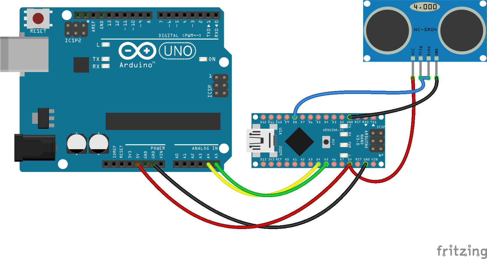

# HC-SR04 Ultrasonic Sensor package for Johnny Five


By default HCSR04 ultrasonic sensors don't work with johnny-five. This is because
they use a custom protocol that requires pulseIn which is not part of the core
firmata.

To overcome this for arduinos you can use a custom firmata (installable from this
package) however for devices like Raspberry Pis, you can't directly connect these
devices.

As such a "BackPack" provides the ability to use devices such as this using
I2C which is supported by all Johnny-Five boards. More info on this can be
found at [NodeBots Interchange](http://github.com/ajfisher/nodebots-interchange).

## Installation and getting started

Installation can be done manually using:

```sh
npm install nodebots-hcsr04
```

However if you are using johnny five then you can use
[Interchange](http://github.com/ajfisher/nodebots-interchange) instead

## Firmware installation using Interchange

Interchange is the preferred method of installation with the following instructions
being the way to do it.

A "supported board" means that precompiled binaries are shipped in the repo. This
means you don't need to install arduino to be able to install this on your board
(this is especially useful if you're on a chromebook).

To get started with interchange:

```
npm install nodebots-interchange
```

This will place the `interchange` application in your `node_modules/.bin` folder
and you can either run this directly or add `./node_modules/.bin` to your path
in order to run it. The sections below explain how to use it and see the
[Interchange documentation](http://github.com/ajfisher/nodebots-interchange/)
for more details and examples.

### I2C Backpack.

The I2C backpack is the preferred method of use as it's a separate module, and
won't impact the performance of your main Arduino running firmata. In addition
you can use this on any nodebots device that supports an I2C connection through
it's IO Plugin (eg RPI, BeagleBone, Tessel etc).

Currently supported devices (and their board names):

* Arduino Nano (preferred) (nano)
* Arduino ProMini (pro-mini)
* Arduino Uno (uno)

To install, you need to put your backpack into "configuration mode". After flashing,
this will configure the board with firmware IDs and default I2C address. Simply
jump pin D2 HIGH (connect D2 to 5V). Once complete, remove this jumper to use
normally (see wiring diagram below).


Then use interchange to flash and configure the board.

```sh
interchange install hc-sr04 -p <port> -a <board=[nano|uno|pro-mini]>
```

Where `<board>` is the type of board using the names given above and `<port>`
is the name or address of the serial port (eg: /dev/tty.usbserial1450).

To use the ping sensor, wire it up as the diagram below shows and then you can
use it with the Johnny Five controller. Note that the trigger and echo are
wired to the same pin which is D8 on the backpack.



### Custom firmata

If you have an arduino and want to use a custom firmata you can simply install
the firmware directly.

```
interchange install hc-sr04 --firmata -a <board> -p <port>
```

Currently supported devices are (and their name for use above):

* Arduino Uno (uno)
* Arduino Nano (nano)
* Arduino ProMini (pro-mini).

If you want to use a different board then open the `firmware/build/hcsr04_firmata`
directory and compile the files using Arduino or GCC. Upload using your normal
process from there.

## Developing

Generally speaking it's a case of simply cloning the repo, doing an npm install
and doing development as normal.

One thing to note is that all pull requests require rebuilding the application
in order to generate a new set of builds. For this it's handy to make sure you
have the `ARDUINO_PATH` environment variable set and then a `grunt compile` is
all you need.

`ARDUINO_PATH` is simply a full path to the arduino run time, noting that you also
must have a version more recent than 1.6.2 in order to get command line benefits.

To make a build, simply `grunt compile` and it should do everything needed.

### Arduino Version

Currently this repo uses the Arduino 1.6.6 build in order to maintain consistency
of build process with regards to where compiled Hexes end up.

## Tests

Before issuing a pull request, please deliver appropriate tests and also make
sure the test suite has been run completely - this will ensure build and
hex files are in the right location.
